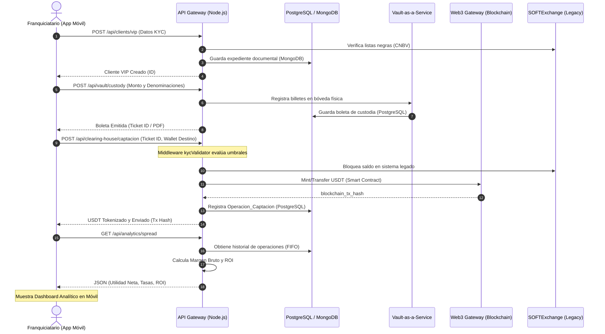

# User Journey MVP: Orquestador Principal

Este documento describe el flujo funcional (User Journey) del MVP, donde un franquiciatario da de alta a un cliente VIP, recibe efectivo en custodia (Vault-as-a-Service), tokeniza el efectivo a USDT para un pago internacional, y finalmente visualiza su utilidad neta en la app móvil.

## Diagrama de Secuencia (Mermaid)



## Seudocódigo del Orquestador (TypeScript)

A continuación, se presenta la lógica principal de los controladores y servicios implicados en este flujo:

```typescript
// ==========================================
// 1. Alta de Cliente VIP
// ==========================================
async function registerVipClient(clientData: VIPClientDTO) {
    // 1. Validar listas negras en sistema legado (SOFTExchange)
    const isBlacklisted = await SOFTExchange.checkBlacklist(clientData.rfc);
    if (isBlacklisted) throw new Error("Cliente bloqueado por CNBV");

    // 2. Guardar expediente en MongoDB
    const kycStatus = await DocumentService.verify(clientData.documents);
    const client = await MongoDB.clients.create({ 
        ...clientData, 
        kycStatus,
        riskLevel: 'LOW' 
    });

    return client;
}

// ==========================================
// 2. Recepción de Efectivo (Vault-as-a-Service)
// ==========================================
async function receiveCashInCustody(clientId: string, currency: string, totalAmount: number, denominations: Record<string, number>) {
    // 1. Validar que la suma de denominaciones coincida con el total
    validateDenominationsMatchTotal(denominations, totalAmount);
    
    // 2. Generar ID de boleta
    const ticketId = generateUniqueTicketId();
    
    // 3. Registrar en PostgreSQL (Core ERP)
    await PostgreSQL.custodyTickets.save({ 
        ticketId, 
        clientId, 
        currency, 
        totalAmount, 
        denominations,
        status: 'IN_VAULT'
    });
    
    // 4. Actualizar saldo en sistema legado
    await SOFTExchange.updateVaultBalance(currency, totalAmount);
    
    return generatePDFReceipt(ticketId);
}

// ==========================================
// 3. Tokenización y Pago Internacional (On-ramp)
// ==========================================
async function tokenizeAndPay(ticketId: string, targetWallet: string) {
    // 1. Obtener boleta de custodia
    const ticket = await PostgreSQL.custodyTickets.findById(ticketId);
    
    // 2. Obtener tipo de cambio en tiempo real (Redis)
    const exchangeRate = await Redis.getLiveRate(`${ticket.currency}_USDT`);
    const usdtAmount = ticket.totalAmount / exchangeRate;

    // 3. Ejecutar Smart Contract vía Web3 (On-ramp)
    const txHash = await Web3Gateway.mintAndTransferUSDT(targetWallet, usdtAmount);

    // 4. Registrar operación en la Cámara de Compensación
    await PostgreSQL.operacionesCaptacion.save({
        erp_operation_id: ticketId,
        client_id: ticket.clientId,
        monto_fiat: ticket.totalAmount,
        moneda_fiat: ticket.currency,
        monto_usdt: usdtAmount,
        blockchain_tx_hash: txHash,
        estado: 'COMPLETADO'
    });

    // 5. Marcar boleta como procesada
    await PostgreSQL.custodyTickets.updateStatus(ticketId, 'TOKENIZED');

    return { status: 'SUCCESS', txHash, usdtAmount };
}

// ==========================================
// 4. Visualización de Utilidad Neta (Spread Analytics)
// ==========================================
async function getNetProfitAnalytics() {
    // 1. Obtener operaciones recientes (24h)
    const operations = await PostgreSQL.operacionesCaptacion.getRecent('24h');
    
    let totalCostMXN = 0;
    let totalRevenueMXN = 0;

    // 2. Aplicar Metodología FIFO para calcular margen
    for (const op of operations) {
        // Costo de adquisición (Ventanilla)
        const buyCost = op.monto_fiat / op.window_buy_rate; 
        totalCostMXN += buyCost;
        
        // Ingreso por liquidación (P2P)
        const sellRevenue = op.monto_usdt * op.p2p_settlement_rate;
        totalRevenueMXN += sellRevenue;
    }

    // 3. Calcular Utilidad Neta y ROI
    const netProfitMXN = totalRevenueMXN - totalCostMXN;
    const roiPercentage = (netProfitMXN / totalCostMXN) * 100;

    return { 
        netProfitMXN, 
        roiPercentage: roiPercentage.toFixed(2), 
        period: '24h' 
    };
}
```
